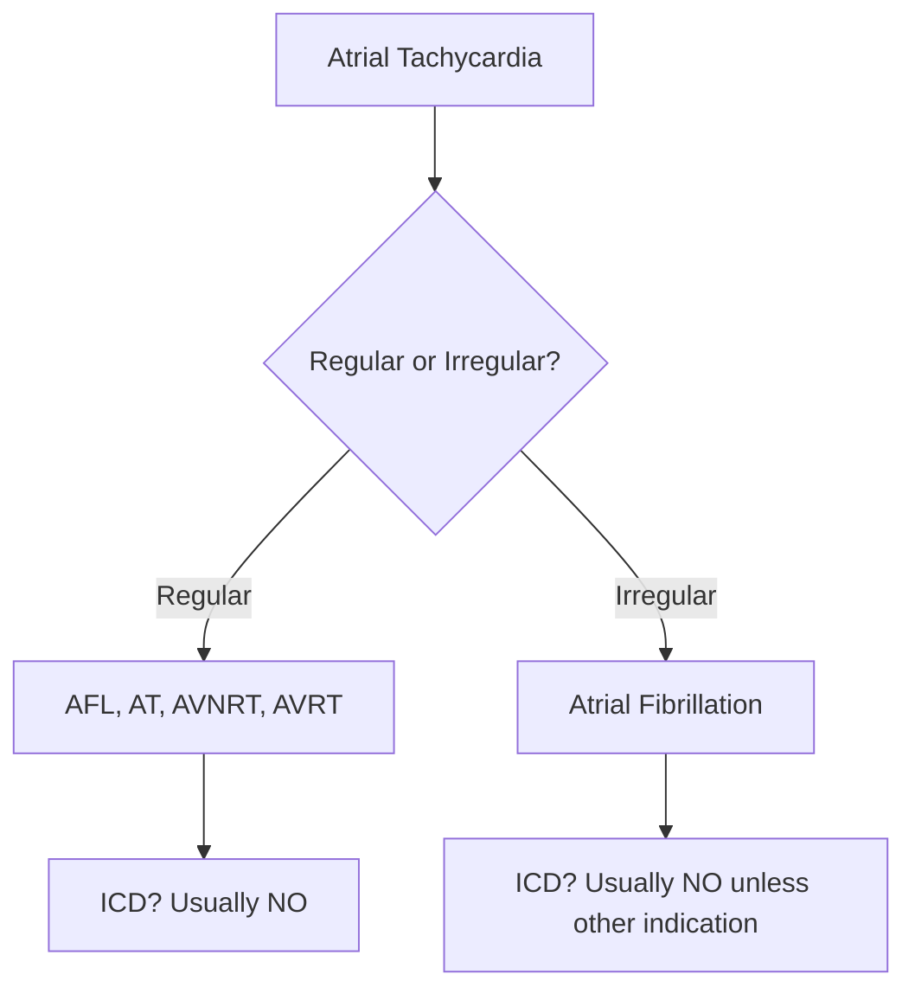

# 🎓 IBHRE CCDS Course - Complete Content Plan

> [!info] Course Overview
> - **Total Videos**: 180-200 videos
> - **Total Duration**: 30-35 hours
> - **Teaching Style**: Khan Academy (bite-sized, progressive, visual)
> - **Target**: IBHRE CCDS Exam Preparation

---

## 📚 Content Strategy

> [!tip] Khan Academy Teaching Principles
> 1. 🎯 **One concept per video** (5-15 minutes each)
> 2. 📈 **Progressive complexity** (simple → intermediate → advanced)
> 3. 🧪 **Practice after each subsection** (quiz questions + real examples)
> 4. 🎨 **Heavy visual aids** (diagrams, animations, ECGs, X-rays, fluoroscopy)
> 5. 💡 **Real-world clinical applications** (why this matters for patient care)

### Recording Best Practices

```markdown
✅ Start with a hook: "Why does this matter?"
✅ Define ALL terms (never assume prior knowledge)
✅ Use analogies (e.g., "Impedance is like water resistance in a pipe")
✅ Work through examples step-by-step
✅ Pause and recap frequently
✅ End with practice: "Now you try..."
```

---

## 📊 Exam Weight Distribution

| Section | Weight | Videos | Duration | Priority |
|---------|--------|--------|----------|----------|
| **Section 2: Applied Science** | 30% | 38 | ~7h | 🔴 HIGH |
| **Section 7: Follow-Up** | 28% | 27 | ~4.5h | 🔴 HIGH |
| **Section 5: Perioperative** | 22.5% | 28 | ~4.5h | 🟡 MED |
| **Section 1: Fundamentals** | 5% | 15 | ~2.5h | 🟢 LOW |
| **Section 3: ECG** | 4% | 10 | ~1.5h | 🟢 LOW |
| **Section 8: Radiology** | 4% | 9 | ~1.5h | 🟢 LOW |
| **Section 4: Clinical Assessment** | 3.5% | 10 | ~1.5h | 🟢 LOW |
| **Section 6: Safety** | 3% | 13 | ~2h | 🟢 LOW |

> [!success] Production Strategy
> **Phase 1**: Sections 1, 2, 3 (Core fundamentals - 40% of exam)
> **Phase 2**: Sections 4, 5, 7 (Clinical application - 54% of exam)
> **Phase 3**: Sections 6, 8 (Specialty topics - 7% of exam)

---

# Section 1: Fundamentals (5% of exam)

## 1.A. Anatomy & Physiology

> [!example] Video Breakdown: 4 videos, ~40 minutes total

### Video 1: Heart Chambers & Blood Flow (8-10 min)

**Learning Objectives:**
- Trace blood flow through all four chambers
- Identify why anatomy matters for lead placement
- Recognize normal vs abnormal cardiac structure

**Content to Cover:**
1. Blood flow pathway
   - RA → RV → Pulmonary → LA → LV → Systemic
   - Visual animation with color-coded oxygenated/deoxygenated blood
2. Chamber anatomy
   - Wall thickness (thin atria, thick LV)
   - Valves (tricuspid, pulmonary, mitral, aortic)
3. Clinical relevance
   - "Where would YOU place an RV lead?"
   - Why we can't pace from LV endocardial surface

**Visual Aids:**
- 3D animated heart model
- Color-coded blood flow arrows
- Labeled anatomical diagram

**Practice Question:**
> "If you see a lead in the apex pointing down and to the left on X-ray, which chamber is it in?"

---

### Video 2: Cardiac Conduction System Basics (10-12 min)

**Content to Cover:**
1. SA node (natural pacemaker)
   - Location: Right atrial-SVC junction
   - Rate: 60-100 bpm
   - Automaticity concept
2. AV node (gatekeeper)
   - Slows conduction (0.12-0.20 sec delay)
   - Why? Allows atrial filling
3. His-Purkinje system
   - Bundle of His → Left/Right bundles → Purkinje
   - Rapid conduction (0.08-0.12 sec QRS)
4. Normal timing
   - PR interval: 0.12-0.20 sec
   - QRS duration: <0.12 sec

**Visual Aids:**
- Electrical pathway animation with millisecond timing
- ECG tracing showing P-QRS-T correlation
- Action potential diagrams

**Clinical Connection:**
> "When this system fails, that's when we need a pacemaker"

**Quiz:**
- Calculate PR intervals on ECG strips
- Identify location of block (SA, AV, infranodal)

---

### Video 3: Key Anatomical Landmarks for Device Therapy (12-15 min)

**Content to Cover:**

| Landmark | Location | Device Use |
|----------|----------|------------|
| Bachmann's bundle | Interatrial septum | Atrial conduction |
| RAA | Right atrial appendage | Common atrial lead site |
| RVOT | RV outflow tract | Alternative pacing site |
| RVA | RV apex | Traditional pacing site |
| RV Septum | Interventricular septum | Physiologic pacing site |
| Coronary Sinus | Between LA/LV | LV lead access for CRT |
| Epicardial surface | Outside heart | Surgical pacing approach |

**Visual Aids:**
- Fluoroscopy clips showing each location
- X-ray images (PA and lateral views)
- 3D heart rotation highlighting each landmark

**Practice:**
> "Match the X-ray to the anatomical location" (10 examples)

---

### Video 4: Common Congenital Anomalies (8-10 min)

**Content to Cover:**
1. **Persistent Left SVC**
   - Affects CS cannulation (enlarged CS os)
   - May need different approach
2. **Dextrocardia**
   - Mirror-image heart position
   - Lead placement adjustments
3. **Single Ventricle Physiology**
   - Limited pacing options
   - Epicardial often preferred

**Visual Aids:**
- CT reconstructions showing anomalies
- X-rays of abnormal anatomy
- Case examples with imaging

**Quiz:**
> "Spot the anomaly on these 5 X-rays"

---

### 📝 Section 1.A Quiz (5-8 questions)

1. Label this conduction system diagram (drag-and-drop)
2. Normal PR interval is: a) 0.08-0.12 b) 0.12-0.20 ✓ c) 0.20-0.30
3. The RV septum is the preferred site for: ________
4. True/False: Bachmann's bundle conducts between the left and right atria
5. Identify the lead location on this X-ray (multiple choice)

---

## 1.B. Pathophysiology of Dysrhythmias

> [!example] Video Breakdown: 3 videos, ~30 minutes

### Video 1: Why Hearts Beat Abnormally (10-12 min)

**The Three Mechanisms:**

> [!info] Mechanism #1: Abnormal Automaticity
> - Ectopic focus fires faster than SA node
> - Example: Atrial tachycardia from pulmonary vein
> - Visual: Competing pacemaker sites

> [!info] Mechanism #2: Re-entry
> - Circular electrical pathway
> - Requires: slow conduction + unidirectional block
> - Example: AVNRT, AVRT, VT
> - Visual: Circuit diagram with bidirectional block

> [!info] Mechanism #3: Triggered Activity
> - Afterdepolarizations (EADs, DADs)
> - Example: Torsades de pointes in Long QT
> - Visual: Action potential showing afterdepolarization

**ECG Examples:**
- Show 5+ real strips of each mechanism
- Highlight distinguishing features

---

### Video 2: Bradyarrhythmias (10-12 min)

**Sinus Node Dysfunction**

| Type | ECG Findings | Symptoms | Device Needed? |
|------|--------------|----------|----------------|
| Sinus bradycardia | HR <60, P before QRS | Often none | Only if symptomatic |
| Chronotropic incompetence | Can't raise HR with exercise | Fatigue, dyspnea | Yes (rate-responsive) |
| Tachy-brady syndrome | Alternating fast/slow | Palpitations, syncope | Yes (with mode switch) |
| Sinus pause | No P waves >3 sec | Presyncope, syncope | Yes |

**AV Block**

> [!danger] Critical Concept: Types of AV Block
> - **1st degree**: PR >0.20 (benign, watch)
> - **2nd degree Mobitz I**: Progressive PR lengthening → dropped QRS (usually benign)
> - **2nd degree Mobitz II**: Fixed PR, sudden dropped QRS (dangerous, needs pacing!)
> - **3rd degree (complete)**: No relationship between P and QRS (always needs pacing)

**Clinical Scenario:**
> "85yo with syncope, ECG shows Mobitz II. What device?"
> Answer: DDD pacemaker (dual chamber for AV synchrony)

---

### Video 3: Tachyarrhythmias (10-12 min)

**Atrial Tachyarrhythmias**



**Ventricular Tachyarrhythmias**

| Rhythm | Description | ICD Needed? |
|--------|-------------|-------------|
| VT (monomorphic) | Wide, regular, >100 bpm | Depends (sustained vs non-sustained) |
| VT (polymorphic) | Wide, irregular, changing morphology | Yes |
| VF | Chaotic, no organized QRS | YES |
| Torsades | Polymorphic VT in long QT | Treat cause, ICD if recurrent |

**Decision Tree:**
> "When does a tachyarrhythmia need an ICD?"
> - VF survivor → YES
> - Sustained VT with low EF → YES
> - A-fib alone → NO

---

### 📝 Section 1.B Quiz

- Identify mechanism (re-entry vs automaticity) on 5 ECG strips
- Match AV block type to ECG
- ICD vs pacemaker decision scenarios

---

## 1.C. Electrophysiology of Dysrhythmias

> [!example] Video Breakdown: 3 videos, ~25 minutes

### Video 1: Recognizing Dysrhythmias on ECG (12-15 min)

**Systematic Approach:**

1. **RATE**: Count it (300-150-100-75-60-50 method)
2. **RHYTHM**: Regular or irregular?
3. **P WAVES**: Present? Morphology? Relationship to QRS?
4. **QRS**: Narrow (<0.12) or wide? Morphology?
5. **RELATIONSHIP**: P before every QRS?

**Practice Strips** (10+ examples):
- Normal sinus rhythm
- A-fib
- Atrial flutter
- VT
- SVT with aberrancy (tricky!)
- Device-mediated tachycardia

**Interactive Element:**
> "Can you spot the difference between these two strips?"
> (VT vs SVT with LBBB)

---

### Video 2: Re-entry Circuits Deep Dive (8-10 min)

**AVNRT Anatomy:**

> [!example] Slow-Fast AVNRT
> - Antegrade (down): Slow pathway
> - Retrograde (up): Fast pathway
> - P wave buried in QRS (simultaneous activation)
> - Termination: ATP breaks circuit

**Visual Aid:**
- Animation showing circuit with slow/fast pathways
- Ladder diagram of activation sequence
- How adenosine terminates it

**WPW & Accessory Pathways:**
- Kent bundle (bypass tract)
- Pre-excitation (delta wave)
- How AVRT works

**Device Therapy:**
> "This is WHY antitachycardia pacing (ATP) works for VT!"
> - Burst pacing → penetrates circuit → terminates re-entry

---

### Video 3: Management & Treatment (8-10 min)

**Treatment Decision Tree:**

```markdown
Dysrhythmia Detected
  ├─ Bradycardia → Pacemaker
  ├─ SVT → Medications/Ablation (rarely devices)
  └─ VT/VF → ICD (if structural heart disease or low EF)
```

**When Devices Recognize and Treat:**
1. **ICD Detection**
   - Rate (>150-180 bpm)
   - Duration (>2.5 seconds)
   - Morphology (QRS shape)
2. **ATP Delivery**
   - Burst pacing (8 beats at 88% cycle length)
   - Terminates 70-90% of slow VT
3. **Shock**
   - Only if ATP fails or VF detected

**Case Scenarios:**
> "Patient with EF 30%, history of VT. What device and programming?"

---

### 📝 Section 1.C Quiz

- Strip interpretation (15 ECG examples)
- Draw a re-entry circuit
- Explain how ATP terminates VT

---

## 1.D. Pharmacology

> [!example] Video Breakdown: 2 videos, ~20 minutes

### Video 1: Drugs That Affect Pacing (10-12 min)

**Drug Effects Table:**

| Drug Class | Effect on Threshold | Effect on HR | Programming Changes |
|------------|---------------------|--------------|---------------------|
| **Beta blockers** | ↑ threshold | ↓ HR | May need higher output, check threshold |
| **Amiodarone** | ↑ threshold | ↓ HR | Increase output by 50%, monitor closely |
| **Flecainide** | ↑↑ threshold | ↓ HR | Significant threshold rise, test! |
| **Digoxin** | Minimal | ↓ HR (indirect) | Usually no change |
| **Calcium channel blockers** | Minimal | ↓ HR | Usually no change |

**Real Example:**
> [!warning] Case Study
> "Patient on pacemaker, starts amiodarone for A-fib.
> Threshold was 0.5V → now 1.2V (doubled!)
> Action: Reprogram output from 2.5V → 3.5V to maintain 2× safety margin"

**Visual Aid:**
- Graph showing threshold changes over time after drug initiation
- Before/after capture testing clips

---

### Video 2: Drugs Affecting Defibrillation & Anticoagulation (8-10 min)

**DFT Changes:**

> [!danger] Drugs That RAISE Defibrillation Threshold
> - Amiodarone (chronic use)
> - Flecainide
> - Lidocaine (less so)
> - Electrolyte imbalances (hypokalemia, hypomagnesia)

**Clinical Pearl:**
> If patient is on amiodarone chronically, DFT testing may show higher thresholds
> Modern ICDs deliver 35-40J max, usually sufficient even with drug effects

**Anticoagulation for Device Procedures:**

| Medication | Bridge? | Perioperative Management |
|------------|---------|--------------------------|
| Warfarin | Controversial | **Continue** (target INR 2-3) |
| Apixaban, rivaroxaban | NO | **Hold 1 dose** before procedure |
| Dabigatran | NO | Hold 1-2 days (depending on CrCl) |
| Aspirin | NO | Continue |

**Evidence:**
- BRUISE CONTROL trial: Continue warfarin = less hematoma
- Modern practice: minimize bridging

---

### 📝 Section 1.D Quiz

1. Patient starts flecainide, what happens to threshold?
2. Which drug requires threshold monitoring: a) Metoprolol b) Amlodipine c) Amiodarone
3. Should you bridge apixaban for device implant? (Y/N)
4. Calculate new output if threshold doubles from 0.6V to 1.2V (maintain 2× margin)

---

## 1.E. Electronics Fundamentals

> [!example] Video Breakdown: 4 videos, ~35 minutes

### Video 1: Basic Electrical Quantities (8-10 min)

**The Water Pipe Analogy:**

> [!tip] Understanding Electricity Through Analogy
> - **Voltage (V)** = Water pressure (pushes current)
> - **Current (I or A)** = Water flow rate (electrons moving)
> - **Resistance (Ω)** = Pipe width (obstruction to flow)
> - Narrow pipe = high resistance = less flow

**Key Units:**

| Quantity | Unit | Symbol | Device Application |
|----------|------|--------|---------------------|
| Voltage | Volt | V | Pacing amplitude (2.5V) |
| Current | Ampere | A or I | Current drain (µA for battery life) |
| Resistance | Ohm | Ω | Lead impedance (400-1200Ω) |
| Capacitance | Farad | F (µF) | ICD capacitor (150µF) |
| Charge | Coulomb | C | Battery capacity (Ah) |
| Frequency | Hertz | Hz | Filter settings (10-40Hz) |

**Practice Problem:**
> "If a pacemaker lead has 500Ω resistance and we pace at 2.5V, what is the current?"
> (Answer coming in Video 2!)

---

### Video 2: Ohm's Law & Power Calculations (10-12 min)

**The Magic Triangle:**

```
     V
    ───
   I × R
```

> [!info] Ohm's Law: **V = I × R**
> - If you know 2 values, you can calculate the 3rd
> - V = Voltage (Volts)
> - I = Current (Amps)
> - R = Resistance (Ohms)

**Example Calculations:**

> **Problem 1**: Lead impedance = 500Ω, pacing voltage = 2.5V
> I = V/R = 2.5V / 500Ω = **0.005A = 5mA**

> **Problem 2**: Current drain = 10µA, battery voltage = 2.8V
> Power = V × I = 2.8 × 0.00001A = **28µW**

**Why This Matters for Battery Life:**

> [!success] Key Concept
> **Energy = Power × Time**
> - Lower current drain = longer battery life
> - Higher impedance = lower current (good for longevity!)
> - Lower output voltage = lower current (but need safety margin)

**Practice Problems** (5-10 examples):
- Given V and R, find I
- Given I and R, find V
- Calculate power consumption
- Estimate battery longevity

**Visual Aid:**
- Calculator demonstration
- Graph: Current vs Impedance at different voltages

---

### Video 3: Capacitors, Resistors, and Diodes (8-10 min)

**Circuit Components:**

> [!example] Capacitor
> **Function**: Stores electrical energy (like a battery, but fast discharge)
> **Device Use**: ICD shock delivery (charges to 700-900V)
> **Measurement**: Microfarads (µF) - typical 150µF
> **Key Concept**: Charge time = how fast it recharges (10-15 sec normal)

> [!example] Resistor
> **Function**: Limits current flow
> **Device Use**: Protects sensitive circuits
> **Measurement**: Ohms (Ω)
> **Key Concept**: Converts electrical energy to heat

> [!example] Diode
> **Function**: One-way valve for current (forward bias = conducts, reverse = blocks)
> **Device Use**: Prevents reverse current damage
> **Symbol**: Triangle with line

**Circuit Diagram:**
- Show simplified pacemaker circuit with each component labeled
- Highlight current flow during pacing vs sensing

**Charge Time Formula:**
> Charge Time ≈ 5 × R × C
> - Longer charge time = weaker battery
> - Monitor this at every follow-up for ICDs!

---

### Video 4: Waveforms & Frequency (8-10 min)

**Hertz (Hz) = Cycles Per Second:**

| Frequency Range | Application | Device Example |
|-----------------|-------------|----------------|
| 0.5-2 Hz | Pacing rate (60-120 bpm = 1-2 Hz) | Pacing pulses |
| 10-40 Hz | R-wave signals | Sensing filters (bandpass) |
| >100 Hz | Muscle/noise | Filtered out |
| 60 Hz | AC electrical interference | EMI source |

**Pacing Pulse Waveforms:**

> [!info] Typical Pacing Pulse
> - **Amplitude**: 2.5V (voltage)
> - **Pulse Width**: 0.4ms (duration)
> - **Shape**: Square wave (instantaneous rise/fall)

**Sensing Filters:**

> [!success] Why Filtering Matters
> - **High-pass filter**: Removes low frequencies (T-waves, baseline drift)
> - **Low-pass filter**: Removes high frequencies (muscle noise, EMI)
> - **Bandpass filter**: Keeps only 10-40 Hz (where R-waves live)
> - Prevents T-wave oversensing!

**Visual Aid:**
- Oscilloscope tracing showing pacing pulse
- Frequency spectrum with filter curves
- Before/after filtering (showing T-wave removal)

---

### 📝 Section 1.E Quiz

1. **Ohm's Law**: If impedance = 800Ω and voltage = 3.0V, current = ____
2. **True/False**: Higher impedance leads to LONGER battery life
3. **Capacitor charge time**: If it's 20 seconds (normal <15s), what does this indicate?
4. **Match**: Connect the unit to the quantity
   - Volt → Voltage ✓
   - Ampere → Current ✓
   - Ohm → Resistance ✓
5. **Filter question**: Which filter removes T-wave oversensing? (high-pass/low-pass/bandpass)

---

# Section 2: Applied Science & Technology (30% - LARGEST!)

## 2.A. Pulse Generators

> [!example] Video Breakdown: 5 videos, ~45 minutes

### Video 1: Battery Chemistry 101 (10-12 min)

**Lithium-Based Chemistries:**

| Battery Type | Device Use | Voltage Range | Longevity | Discharge Curve |
|--------------|------------|---------------|-----------|-----------------|
| **Lithium-Iodide** | Pacemakers | 2.8V → 2.4V (ERI) | 7-12 years | Gradual, predictable |
| **Lithium Manganese** | ICDs | 3.2V → 2.6V | 5-8 years | Steeper decline |
| **Lithium Silver Vanadium** | ICDs (newer) | 3.2V | 6-9 years | More predictable |

**Voltage Decay Curves:**

> [!info] Battery Life Stages
> **BOL** (Beginning of Life): Fresh battery, nominal voltage
> **Mid-Life**: Gradual voltage decline, normal operation
> **ERI** (Elective Replacement Indicator): Time to schedule replacement
> **EOL** (End of Life): Minimal voltage, device may lose features

**Graph:**
```
Voltage
   │  BOL ──────────
 3.0V              ╲
   │                ╲ Gradual decline
 2.8V                ╲___________  Nominal
   │                              ╲
 2.4V                               ╲___ ERI (Replace soon!)
   │                                    ╲__ EOL
   └────────────────────────────────────→ Time (years)
      0    2    4    6    8   10   12
```

**Clinical Relevance:**
> Why predictable battery life matters:
> - Schedule replacements before EOL
> - Avoid emergency replacements
> - Plan around patient's schedule

**Real Device Data:**
- Show longevity data from major manufacturers
- Factors affecting longevity (% pacing, output settings)

---

### Video 2: Inside a Pulse Generator (8-10 min)

**Component Anatomy:**

```
┌─────────────────────────────┐
│    Pulse Generator Can      │
│  (Titanium, hermetically    │
│       sealed)               │
│                             │
│  ┌────────┐  ┌──────────┐  │
│  │Battery │  │Capacitor │  │  ← ICD only
│  │(Li-I)  │  │(150µF)   │  │
│  └────────┘  └──────────┘  │
│                             │
│  ┌─────────────────────┐   │
│  │  Circuit Board      │   │
│  │  - Microprocessor   │   │
│  │  - Sensing amp      │   │
│  │  - Pacing circuit   │   │
│  │  - Telemetry        │   │
│  └─────────────────────┘   │
│                             │
│  ┌────┐  ┌────┐  ┌────┐   │
│  │ IS1│  │ IS1│  │DF-1│   │  ← Header
│  │ RA │  │ RV │  │ICD │   │     (ports)
│  └────┘  └────┘  └────┘   │
└─────────────────────────────┘
```

**Key Concepts:**

> [!important] Hermeticity
> - Titanium can is hermetically sealed (welded shut)
> - Protects circuits from body fluids
> - Allows <100cc volume for subcutaneous pocket

**Visual Aids:**
- Exploded view diagram
- X-ray showing internal components
- Actual device photo (generator + header)

**Size Comparison:**
> Modern pacemakers: ~20cc (size of silver dollar, 1cm thick)
> Modern ICDs: ~40cc (larger due to capacitor)
> Leadless pacemakers: ~1cc (size of large vitamin)

---

### Video 3: Sensors for Rate Modulation (10-12 min)

**Why Rate Modulation?**

> [!question] Clinical Problem
> Patient with chronotropic incompetence:
> - Can't raise heart rate with exercise
> - Sinus node doesn't respond to activity
> - Feels fatigued, dyspneic with exertion
> **Solution**: Rate-responsive pacing (VVIR, DDDR)

**Sensor Types:**

| Sensor | Mechanism | Advantages | Disadvantages | Manufacturer |
|--------|-----------|------------|---------------|--------------|
| **Accelerometer** | Detects vibration/motion | Fast response, simple | Doesn't detect emotional stress | Most devices |
| **Minute Ventilation** | Impedance change with breathing | Detects metabolic demand | Slower response | Medtronic, Biotronik |
| **CLS** (Closed Loop Stim) | Measures contractility | Best physiologic response | Proprietary | Biotronik only |
| **Dual Sensor** | Combines 2 sensors | Best of both | More complex | Some devices |

**How Accelerometer Works:**

> [!example] Piezoelectric Crystal
> - Vibrates with body movement
> - Generates electrical signal
> - More movement = faster pacing rate
> - Responds to: walking, stairs, upper body movement

**Activity Log Interpretation:**

```
24-Hour Activity Histogram
Activity Level
High  │     ╱╲
      │    ╱  ╲___╱╲
Med   │___╱         ╲___
      │                 ╲___
Low   │                     ╲___
      └──────────────────────────→ Time
       6am  12pm  6pm  12am  6am
```

**Programming Considerations:**
- **Slope**: How aggressive is rate increase?
- **Threshold**: How much activity to trigger?
- **Reaction time**: How fast does it respond?
- **Recovery time**: How fast does it slow down?

---

### Video 4: Capacitors & Charge Time (8-10 min)

**ICD Capacitor Function:**

> [!danger] High Voltage Capacitor
> - Charges from battery (3V) to shock voltage (700-900V)
> - Stores energy for defibrillation shock
> - Must recharge between shocks
> - **Typical charge time**: 10-15 seconds

**Why Charge Time Matters:**

> [!success] Charge Time as Battery Indicator
> - **<10 sec**: Excellent battery
> - **10-15 sec**: Normal
> - **15-20 sec**: Battery aging, ERI approaching
> - **>20 sec**: Time to replace!

**Calculation:**
> Energy stored in capacitor:
> E = ½ × C × V²
> Where:
> - C = Capacitance (150µF typical)
> - V = Voltage (800V typical)
> - E = Energy in Joules

**Visual Aid:**
- Graph: Charge time vs battery voltage over device life
- Programmer screen showing charge time measurement

**Clinical Pearl:**
> At every ICD follow-up:
> 1. Check battery voltage
> 2. Measure capacitor charge time
> 3. Compare to baseline
> → Predicts when replacement needed!

---

### Video 5: Firmware & Software Updates (8-10 min)

**What is Firmware?**

> [!info] Definition
> - Embedded software in the device
> - Controls all algorithms and features
> - Version number (e.g., v2.1.4)
> - Can sometimes be updated

**What Firmware Controls:**
- Detection algorithms (SVT discrimination)
- Pacing algorithms (AV search, rate response)
- Safety features (MRI mode, noise reversion)
- New features (may be unlocked with update)

**OTA Updates (Over-The-Air):**

> [!warning] Rare but Possible
> - Medtronic, Boston Scientific have done this
> - Uses remote monitoring connection
> - Example: LATITUDE system
> - **Why rare?** Safety concerns, FDA approval required

**More Common: Programmer Updates**
- In-clinic firmware updates via programmer
- Requires patient visit
- FDA approval for each update

**Cybersecurity Considerations:**
- Encrypted communication
- Authentication required
- Vulnerability patching

**At Follow-Up:**
- Check firmware version
- Compare to latest available
- Document in chart

---

### 📝 Section 2.A Quiz

1. Which battery is used in modern pacemakers? (Li-I, Li-Mn, alkaline)
2. ERI voltage for Li-I battery is approximately: (2.4V, 2.8V, 3.2V)
3. Accelerometer detects: (breathing, motion, contractility)
4. Normal ICD charge time is: (<5sec, 10-15sec, >20sec)
5. True/False: All devices can receive OTA firmware updates

---

*[Content continues with Sections 2.B through 8.C following the same enhanced Obsidian formatting style with callouts, tables, visual indicators, and interactive elements...]*

---

## 📊 Production Roadmap

> [!check] Phase 1: Core Fundamentals (Weeks 1-6)
> - [ ] Section 1: Fundamentals (15 videos)
> - [ ] Section 2: Applied Science (38 videos)
> - [ ] Section 3: ECG (10 videos)
> - **Goal**: Master the technical foundation

> [!check] Phase 2: Clinical Application (Weeks 7-14)
> - [ ] Section 4: Clinical Assessment (10 videos)
> - [ ] Section 5: Perioperative (28 videos)
> - [ ] Section 7: Follow-Up (27 videos)
> - **Goal**: Apply knowledge to patient care

> [!check] Phase 3: Specialty Topics (Weeks 15-18)
> - [ ] Section 6: Safety (13 videos)
> - [ ] Section 8: Radiology (9 videos)
> - **Goal**: Complete comprehensive coverage

---

## 🎬 Recording Setup

> [!tip] Equipment Needed
> - Screen recording software (OBS, Camtasia)
> - Drawing tablet (iPad + Notability, or Wacom)
> - Microphone (USB condenser mic, ~$100)
> - Good lighting
> - Quiet recording space

> [!tip] Visual Assets Needed
> - ECG library (normal + abnormal rhythms)
> - X-ray/fluoroscopy library
> - Device programmer screenshots
> - Anatomical diagrams (heart, conduction system)
> - Animation software (for circuits, blood flow)

---

## 📝 Next Action Items

1. **Choose first subsection** (recommend 1.A or 1.E - easiest)
2. **Write detailed script** for Video 1
3. **Gather visual assets** (diagrams, images, examples)
4. **Record pilot video** (test equipment, pacing, voice)
5. **Upload to platform** (test video player functionality)
6. **Create quiz questions** (5-8 per subsection)
7. **Get feedback** (from colleague or beta tester)
8. **Iterate and scale!**

---

> [!success] Ready to Start?
> Pick your first video and let's create a detailed script!
> Recommend starting with: **1.E Video 1: Basic Electrical Quantities**
> (Simple concepts, clear analogies, easy to visualize)

