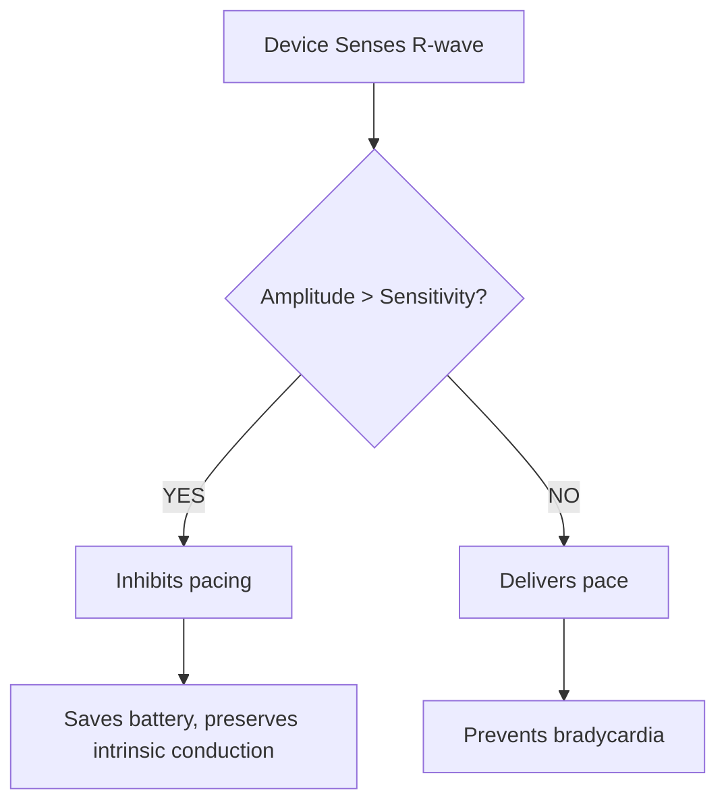
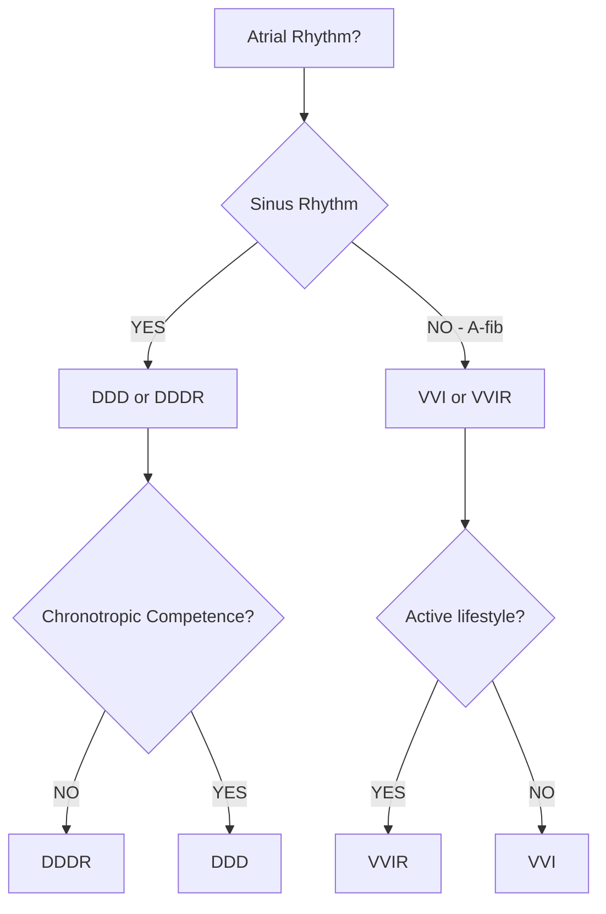

# Section 2: Applied Science & Technology (30% - LARGEST!)

> [!danger] HIGHEST PRIORITY SECTION
> - **Exam Weight**: 30% (nearly 1/3 of entire exam!)
> - **Total Videos**: 38 videos
> - **Duration**: ~7 hours
> - **Priority**: 🔴 HIGH - Master this section!

**Subsections:**
- [[#2.A. Pulse Generators]]
- [[#2.B. Leads]]
- [[#2.C. Sensing]]
- [[#2.D. Pacing]]
- [[#2.E. Defibrillation]]

---

## 2.A. Pulse Generators

> [!example] Video Breakdown: 5 videos, ~45 minutes

### Video 1: Battery Chemistry 101 (10-12 min)

**Lithium-Based Chemistries:**

| Battery Type | Device Use | Voltage Range | Longevity | Discharge Curve |
|--------------|------------|---------------|-----------|-----------------|
| **Lithium-Iodide** | Pacemakers | 2.8V → 2.4V (ERI) | 7-12 years | Gradual, predictable |
| **Lithium Manganese** | ICDs | 3.2V → 2.6V | 5-8 years | Steeper decline |
| **Lithium Silver Vanadium** | ICDs (newer) | 3.2V | 6-9 years | More predictable |

**Voltage Decay Curves:**

> [!info] Battery Life Stages
> **BOL** (Beginning of Life): Fresh battery, nominal voltage
> **Mid-Life**: Gradual voltage decline, normal operation
> **ERI** (Elective Replacement Indicator): Time to schedule replacement
> **EOL** (End of Life): Minimal voltage, device may lose features

**Graph:**
```
Voltage
   │  BOL ──────────
 3.0V              ╲
   │                ╲ Gradual decline
 2.8V                ╲___________  Nominal
   │                              ╲
 2.4V                               ╲___ ERI (Replace soon!)
   │                                    ╲__ EOL
   └────────────────────────────────────→ Time (years)
      0    2    4    6    8   10   12
```

**Clinical Relevance:**
> Why predictable battery life matters:
> - Schedule replacements before EOL
> - Avoid emergency replacements
> - Plan around patient's schedule

**Real Device Data:**
- Show longevity data from major manufacturers
- Factors affecting longevity (% pacing, output settings)

---

### Video 2: Inside a Pulse Generator (8-10 min)

**Component Anatomy:**

```
┌─────────────────────────────┐
│    Pulse Generator Can      │
│  (Titanium, hermetically    │
│       sealed)               │
│                             │
│  ┌────────┐  ┌──────────┐  │
│  │Battery │  │Capacitor │  │  ← ICD only
│  │(Li-I)  │  │(150µF)   │  │
│  └────────┘  └──────────┘  │
│                             │
│  ┌─────────────────────┐   │
│  │  Circuit Board      │   │
│  │  - Microprocessor   │   │
│  │  - Sensing amp      │   │
│  │  - Pacing circuit   │   │
│  │  - Telemetry        │   │
│  └─────────────────────┘   │
│                             │
│  ┌────┐  ┌────┐  ┌────┐   │
│  │ IS1│  │ IS1│  │DF-1│   │  ← Header
│  │ RA │  │ RV │  │ICD │   │     (ports)
│  └────┘  └────┘  └────┘   │
└─────────────────────────────┘
```

**Key Concepts:**

> [!important] Hermeticity
> - Titanium can is hermetically sealed (welded shut)
> - Protects circuits from body fluids
> - Allows <100cc volume for subcutaneous pocket

**Visual Aids:**
- Exploded view diagram
- X-ray showing internal components
- Actual device photo (generator + header)

**Size Comparison:**
> Modern pacemakers: ~20cc (size of silver dollar, 1cm thick)
> Modern ICDs: ~40cc (larger due to capacitor)
> Leadless pacemakers: ~1cc (size of large vitamin)

---

### Video 3: Sensors for Rate Modulation (10-12 min)

**Why Rate Modulation?**

> [!question] Clinical Problem
> Patient with chronotropic incompetence:
> - Can't raise heart rate with exercise
> - Sinus node doesn't respond to activity
> - Feels fatigued, dyspneic with exertion
> **Solution**: Rate-responsive pacing (VVIR, DDDR)

**Sensor Types:**

| Sensor | Mechanism | Advantages | Disadvantages | Manufacturer |
|--------|-----------|------------|---------------|--------------|
| **Accelerometer** | Detects vibration/motion | Fast response, simple | Doesn't detect emotional stress | Most devices |
| **Minute Ventilation** | Impedance change with breathing | Detects metabolic demand | Slower response | Medtronic, Biotronik |
| **CLS** (Closed Loop Stim) | Measures contractility | Best physiologic response | Proprietary | Biotronik only |
| **Dual Sensor** | Combines 2 sensors | Best of both | More complex | Some devices |

**How Accelerometer Works:**

> [!example] Piezoelectric Crystal
> - Vibrates with body movement
> - Generates electrical signal
> - More movement = faster pacing rate
> - Responds to: walking, stairs, upper body movement

**Activity Log Interpretation:**

```
24-Hour Activity Histogram
Activity Level
High  │     ╱╲
      │    ╱  ╲___╱╲
Med   │___╱         ╲___
      │                 ╲___
Low   │                     ╲___
      └──────────────────────────→ Time
       6am  12pm  6pm  12am  6am
```

**Programming Considerations:**
- **Slope**: How aggressive is rate increase?
- **Threshold**: How much activity to trigger?
- **Reaction time**: How fast does it respond?
- **Recovery time**: How fast does it slow down?

---

### Video 4: Capacitors & Charge Time (8-10 min)

**ICD Capacitor Function:**

> [!danger] High Voltage Capacitor
> - Charges from battery (3V) to shock voltage (700-900V)
> - Stores energy for defibrillation shock
> - Must recharge between shocks
> - **Typical charge time**: 10-15 seconds

**Why Charge Time Matters:**

> [!success] Charge Time as Battery Indicator
> - **<10 sec**: Excellent battery
> - **10-15 sec**: Normal
> - **15-20 sec**: Battery aging, ERI approaching
> - **>20 sec**: Time to replace!

**Calculation:**
> Energy stored in capacitor:
> E = ½ × C × V²
> Where:
> - C = Capacitance (150µF typical)
> - V = Voltage (800V typical)
> - E = Energy in Joules

**Visual Aid:**
- Graph: Charge time vs battery voltage over device life
- Programmer screen showing charge time measurement

**Clinical Pearl:**
> At every ICD follow-up:
> 1. Check battery voltage
> 2. Measure capacitor charge time
> 3. Compare to baseline
> → Predicts when replacement needed!

---

### Video 5: Firmware & Software Updates (8-10 min)

**What is Firmware?**

> [!info] Definition
> - Embedded software in the device
> - Controls all algorithms and features
> - Version number (e.g., v2.1.4)
> - Can sometimes be updated

**What Firmware Controls:**
- Detection algorithms (SVT discrimination)
- Pacing algorithms (AV search, rate response)
- Safety features (MRI mode, noise reversion)
- New features (may be unlocked with update)

**OTA Updates (Over-The-Air):**

> [!warning] Rare but Possible
> - Medtronic, Boston Scientific have done this
> - Uses remote monitoring connection
> - Example: LATITUDE system
> - **Why rare?** Safety concerns, FDA approval required

**More Common: Programmer Updates**
- In-clinic firmware updates via programmer
- Requires patient visit
- FDA approval for each update

**Cybersecurity Considerations:**
- Encrypted communication
- Authentication required
- Vulnerability patching

**At Follow-Up:**
- Check firmware version
- Compare to latest available
- Document in chart

---

### 📝 Section 2.A Quiz

1. Which battery is used in modern pacemakers? (Li-I, Li-Mn, alkaline)
2. ERI voltage for Li-I battery is approximately: (2.4V, 2.8V, 3.2V)
3. Accelerometer detects: (breathing, motion, contractility)
4. Normal ICD charge time is: (<5sec, 10-15sec, >20sec)
5. True/False: All devices can receive OTA firmware updates

---

## 2.B. Leads

> [!example] Video Breakdown: 8 videos, ~80 minutes

### Video 1: Lead Construction & Components (10-12 min)

**Anatomy of a Lead:**

```
┌───────────────────────────────────────┐
│                                       │
│  [Connector Pin (IS-1)]               │
│        ↓                              │
│  [Insulation - Silicone/Polyurethane]│
│        ↓                              │
│  [Conductor - MP35N wire coil(s)]    │
│     • Single coil (unipolar)         │
│     • Dual coil (bipolar)            │
│        ↓                              │
│  [Fixation Mechanism]                │
│     • Active (helix)                 │
│     • Passive (tines)                │
│        ↓                              │
│  [Electrode (Tip)]                   │
│     • Steroid-eluting                │
│     • High impedance coating         │
│                                       │
└───────────────────────────────────────┘
```

**Key Materials:**

| Component | Material | Purpose |
|-----------|----------|---------|
| **Conductor** | MP35N (cobalt-nickel alloy) | Carries electrical signal |
| **Insulation** | Silicone or Polyurethane | Protects conductor, biocompatible |
| **Electrode** | Platinum-iridium | Biocompatible, durable |
| **Fixation** | Nitinol (helix) or silicone (tines) | Secures lead in position |
| **Steroid** | Dexamethasone | Reduces inflammation, lowers threshold |

**Visual Aids:**
- Cross-section diagram of lead
- Exploded view showing layers
- Electron microscope images of electrode surface

---

### Video 2: Active vs Passive Fixation (8-10 min)

**Active Fixation (Screw-in)**

> [!success] Advantages
> - Can be placed anywhere (not limited to trabeculated areas)
> - More stable (less dislodgement)
> - Ideal for atrial leads (smooth endocardium)
> - Better for thin patients (less trauma during extraction)

> [!warning] Disadvantages
> - More traumatic to myocardium
> - Higher initial threshold (penetrates muscle)
> - Risk of perforation if advanced too far
> - Requires fluoroscopy for deployment

**Visual**: Fluoroscopy video showing helix deployment

**Passive Fixation (Tines)**

> [!success] Advantages
> - Less traumatic to implant
> - Lower initial threshold (rests on endocardium)
> - Simpler to implant (no deployment mechanism)
> - Lower risk of perforation

> [!warning] Disadvantages
> - Requires trabeculated tissue (RV apex, RA appendage)
> - Higher dislodgement rate (especially atrial)
> - Limited placement options
> - More difficult to extract

**Clinical Decision:**
> **Active**: Atrial leads, alternative RV sites (septum, RVOT)
> **Passive**: RV apex (traditional placement)

---

### Video 3: Unipolar vs Bipolar Leads (10-12 min)

**Configuration Comparison:**

| Feature | Unipolar | Bipolar |
|---------|----------|---------|
| **Electrodes** | Tip only (cathode) | Tip + Ring (cathode + anode) |
| **Anode location** | Pulse generator can | Ring electrode on lead |
| **Sensing distance** | Large (tip to can) | Small (tip to ring ~1cm) |
| **Pacing artifact** | Large spike on ECG | Small spike on ECG |
| **EMI susceptibility** | Higher | Lower |
| **Lead diameter** | Thinner | Slightly thicker |
| **Modern use** | Rare (mostly bipolar now) | Standard |

**Pacing Vectors:**

> [!example] Unipolar Pacing
> ```
> Cathode (−) = Tip electrode
> Anode (+) = Pulse generator can
> Current flows: Tip → Heart → Can
> ```

> [!example] Bipolar Pacing
> ```
> Cathode (−) = Tip electrode
> Anode (+) = Ring electrode
> Current flows: Tip → Ring (localized)
> ```

**Sensing Implications:**

> [!important] Bipolar Sensing Advantage
> - Smaller sensing vector = less noise
> - Rejects far-field signals (P-waves on V-lead)
> - Less myopotential interference
> - **Result**: Better discrimination of cardiac signals

**Visual Aid:**
- ECG showing unipolar vs bipolar pacing spikes
- Diagram of current flow patterns
- Programmer screenshots showing sensing amplitudes

---

### Video 4: Steroid-Eluting Leads (8-10 min)

**Why Steroids?**

> [!question] The Problem: Threshold Rise After Implant
> - Lead implantation causes tissue injury
> - Inflammatory response creates fibrosis
> - Fibrosis increases impedance → raises threshold
> - Peak threshold: 2-6 weeks post-implant

**The Solution:**

> [!success] Steroid-Eluting Tip
> - Dexamethasone embedded in tip
> - Slowly releases over 6-12 months
> - Suppresses inflammation
> - **Result**: Lower chronic thresholds (0.5V vs 2.0V)

**Threshold Curve Comparison:**

```
Threshold (V)
   │
3.0│     ╱╲ Non-steroid lead (peaks at 6 weeks)
   │    ╱  ╲___
2.0│   ╱       ╲_______
   │  ╱
1.0│ ╱____________ Steroid lead (stays low)
   │╱
0.5│────────────────────────→ Time
   0   2w  6w  3m  6m  12m
```

**Clinical Impact:**
- Lower output settings → longer battery life
- More safety margin
- Less likely to lose capture
- **Standard of care** for modern leads

**Visual Aid:**
- Microscopic images of steroid collar
- Histology showing reduced fibrosis
- Real-world threshold data graphs

---

### Video 5: Lead Impedance Explained (10-12 min)

**What is Impedance?**

> [!info] Definition
> Impedance = Resistance to alternating current (AC)
> - Measured in Ohms (Ω)
> - Normal range: 400-1200Ω
> - Affected by: lead integrity, electrode surface area, tissue interface

**Normal Values by Lead Type:**

| Lead Type | Normal Impedance | Clinical Significance |
|-----------|------------------|----------------------|
| **Pacing leads** | 400-1200Ω | Optimal for capture |
| **High impedance** | >1200Ω | Possible fracture, insulation break |
| **Low impedance** | <200Ω | Possible insulation breach, short circuit |
| **ICD coil** | 25-80Ω | Shock delivery (low is good) |

**Why Higher Impedance Can Be GOOD:**

> [!success] Ohm's Law Application
> V = I × R
> If R ↑ (higher impedance), then I ↓ (lower current)
> Lower current = less battery drain = longer longevity!
>
> **Sweet spot**: 600-900Ω (good capture + good longevity)

**Impedance Trends:**

```
Impedance (Ω)
   │
1500│                          ╱── Lead fracture!
   │                         ╱
1200│ ───────────────────────  Upper normal
   │
 800│ ════════════════════════  Stable (ideal)
   │
 400│ ────────────────────────  Lower normal
   │  ╲
 200│   ╲__ Insulation breach
   │      ╲
   0│       ────────────────────→ Follow-ups
      Imp  3m  6m  1y  2y  3y
```

**Clinical Pearls:**
- Sudden ↑ impedance = fracture until proven otherwise
- Sudden ↓ impedance = insulation failure
- Gradual changes are usually normal maturation

---

### Video 6: Connector Standards (IS-1, DF-1, DF-4) (8-10 min)

**Why Standardization Matters:**

> [!important] Interoperability
> - Allows mixing manufacturers (Abbott lead + Medtronic generator)
> - Simplifies inventory
> - Ensures compatibility

**Connector Types:**

| Standard | Use | Configuration | Adopted |
|----------|-----|---------------|---------|
| **IS-1** | Pacing/Sensing | Single pin (3.2mm) | 1986 |
| **DF-1** | ICD shock | Single 3.2mm coax pin | 1993 |
| **DF-4** | ICD shock | Quadripolar (4-contact) | 2010 |
| **IS-4** | Quadripolar pacing | 4-contact (LV leads) | 2010 |

**Visual Comparison:**

```
IS-1 (Bipolar Pacing):
  ┌──┐
  │  │← Ring contact
  │──│
  │  │← Tip contact
  └──┘

DF-1 (ICD with adapter):
  ┌────┐
  │    │← HV coil
  │────│← Adapter/Y-cable
  │    │← Pace/sense
  └────┘

DF-4 (Integrated):
  ┌──┐
  │▓▓│← HV shocking contacts
  │▓▓│← RV coil contact
  │  │← Ring (anode)
  │  │← Tip (cathode)
  └──┘
```

**DF-4 Advantages:**
- Eliminates set screw in header
- Reduces points of failure
- Smaller header = smaller device
- Becoming standard for ICDs

---

### Video 7: Lead Complications (10-12 min)

**Major Complications:**

> [!danger] Lead Fracture
> **Cause**: Mechanical stress (subclavian crush, twiddler's)
> **Presentation**: High impedance, loss of capture, oversensing noise
> **Diagnosis**: Impedance trend, high-voltage test, fluoroscopy
> **Management**: Lead replacement or revision

> [!danger] Insulation Breach
> **Cause**: Erosion (lead-lead friction, pocket trauma)
> **Presentation**: Low impedance, pacing inhibition (sensing muscle)
> **Diagnosis**: Impedance trend, provocative maneuvers
> **Management**: Lead replacement, consider extraction

> [!danger] Lead Dislodgement
> **Cause**: Inadequate fixation, patient activity, anatomical factors
> **Presentation**: Loss of capture, sensing failure, positional symptoms
> **Diagnosis**: Chest X-ray, threshold testing
> **Management**: Repositioning (if acute) or replacement

**Timeframe:**

| Complication | Typical Timing | Risk Factors |
|--------------|----------------|--------------|
| Dislodgement | <30 days | Passive fixation, atrial leads |
| Fracture | >2 years | Subclavian stick, thin patients |
| Insulation breach | >5 years | Multiple leads, tight pocket |

**Case Examples:**
- Show X-rays of each complication
- Impedance graphs showing sudden changes
- EGM tracings showing noise/oversensing

---

### Video 8: Leadless Pacemakers (8-10 min)

**Technology Overview:**

> [!success] What's Different?
> - No transvenous lead (entire device in RV)
> - Delivered via femoral vein
> - Self-contained battery + electrodes
> - Size: ~1cc (vitamin-sized)

**Current Devices:**

| Device | Manufacturer | Battery Life | Features |
|--------|--------------|--------------|----------|
| **Micra** | Medtronic | 10-12 years | VVI(R), MRI conditional, retrieval tines |
| **Aveir** | Abbott | 8-10 years | VVI(R), helix for retrieval |
| **Micra AV** | Medtronic | 8-10 years | Atrial sensing via accelerometer |

**Advantages:**
- No lead complications (fracture, infection)
- No pocket (no pocket hematoma, erosion)
- Better cosmesis
- Useful when no venous access

**Disadvantages:**
- VVI only (no dual chamber yet)
- Can't be extracted easily (endothelialized)
- More expensive upfront
- Requires femoral access

**Indications:**
- Permanent A-fib with AV block
- Failed transvenous lead
- Infected system (bridge therapy)
- High infection risk (dialysis)

**Visual Aid:**
- Fluoroscopy of Micra deployment
- X-ray showing device position
- Size comparison (Micra vs traditional system)

---

### 📝 Section 2.B Quiz

1. Steroid-eluting leads reduce: (a) acute threshold (b) chronic threshold ✓ (c) both
2. Normal pacing lead impedance: (200-400Ω, 400-1200Ω ✓, >1500Ω)
3. DF-4 connectors have ____ contacts (1, 2, 4 ✓)
4. High impedance (>1500Ω) suggests: (fracture ✓, insulation breach, normal)
5. Leadless pacemakers are currently available for: (VVI ✓, DDD, CRT)

---

## 2.C. Sensing

> [!example] Video Breakdown: 8 videos, ~75 minutes

### Video 1: What is Sensing? (8-10 min)

**Basic Concept:**

> [!info] Sensing = Device "Hearing" the Heart
> - Detects intrinsic cardiac electrical activity
> - Determines if pacing is needed
> - Differentiates between rhythms for ICDs

**Why Sensing Matters:**



**Sensing Circuit:**

```
Intracardiac Signal (R-wave)
        ↓
  Bandpass Filter (10-40 Hz)
        ↓
  Amplifier (magnifies signal)
        ↓
  Comparator (compares to threshold)
        ↓
  Sensed Event! (inhibits pacing or triggers therapy)
```

**Visual Aid:**
- EGM showing intrinsic beats with sensing markers
- Diagram of sensing circuit
- Animation of signal processing

---

### Video 2: Sensitivity Settings Explained (10-12 min)

**Understanding Sensitivity:**

> [!warning] Confusing Terminology!
> **Lower number = MORE sensitive**
> - 1.0 mV = very sensitive (detects small signals)
> - 5.0 mV = less sensitive (only detects large signals)
>
> Think: "Lower the bar, easier to sense"

**Normal Sensing Amplitudes:**

| Signal | Typical Amplitude | Programmed Sensitivity | Safety Margin |
|--------|-------------------|------------------------|---------------|
| **P-wave** | 2-6 mV | 0.5 mV | 4:1 |
| **R-wave** | 5-20 mV | 2.5 mV | 2:1 (minimum) |
| **T-wave** | 1-3 mV | Should NOT sense! | |

**AutoSensitivity Algorithms:**

> [!success] Automatic Gain Control
> - Device measures intrinsic amplitude
> - Automatically adjusts sensitivity
> - Maintains 50% safety margin
> - Example: R-wave = 10mV → sets sensitivity to 5mV

**Oversensing vs Undersensing:**

```
OVERSENSING (too sensitive):
  ├─ T-wave oversensing → pacing inhibition
  ├─ Myopotential sensing → inappropriate ICD shocks
  └─ EMI sensing → noise reversion mode

UNDERSENSING (not sensitive enough):
  ├─ Asynchronous pacing → R-on-T
  ├─ Loss of AV synchrony
  └─ ICD fails to detect VT/VF
```

---

### Video 3: Refractory & Blanking Periods (10-12 min)

**Why Refractory Periods?**

> [!important] Prevent Double Counting
> After sensing an event, the device "closes its eyes" temporarily
> - Atrial refractory period (ARP): ~250-400 ms
> - Ventricular refractory period (VRP): ~200-350 ms
> - Post-ventricular atrial refractory period (PVARP): ~200-400 ms

**Timing Diagram:**

```
AP ──┐  250ms     ┌── Can sense next P
     └───────────┘
         ARP

VP ──┐  300ms     ┌── Can sense next R
     └───────────┘
         VRP

VP ──┐  400ms (PVARP) ┌── Can sense P again
     └──────────────┘
     (Prevents far-field R sensing on A-channel)
```

**Blanking Periods:**

> [!example] Total Blindness
> After PACING, device blanks ALL sensing briefly (12-60ms)
> - Prevents sensing the pacing artifact
> - Prevents cross-chamber sensing (atrial pace → V-sense)

**PMT (Pacemaker-Mediated Tachycardia):**

> [!danger] Classic Problem
> 1. PVC → retrograde P-wave
> 2. P-wave sensed after PVARP expires
> 3. Device paces ventricle after AV delay
> 4. Another retrograde P → endless loop!
>
> **Prevention**: Extend PVARP, enable PMT algorithm

**Visual Aid:**
- Ladder diagram showing timing cycles
- EGM with PVARP markers
- PMT example with termination

---

### Video 4: Intrinsic vs Paced Events (8-10 min)

**Nomenclature:**

| Code | Atrium | Ventricle | Example |
|------|--------|-----------|---------|
| **AS** | Atrial Sensed | - | Intrinsic P-wave detected |
| **AP** | Atrial Paced | - | Device delivers atrial stimulus |
| **VS** | - | Ventricular Sensed | Intrinsic QRS detected |
| **VP** | - | Ventricular Paced | Device delivers ventricular stimulus |

**EGM Interpretation:**

```
Example Strip (DDD):
AS─150ms─VS     (Intrinsic beat, no pacing needed)
AS─150ms─VP     (P-wave sensed, paced V after AV delay)
AP─150ms─VS     (Paced atrium, intrinsic V conduction)
AP─150ms─VP     (Fully paced)
```

**Percent Pacing:**

> [!success] Goal: Minimize Unnecessary Pacing
> - Ventricular pacing associated with worse outcomes (except LBBB + HF)
> - Algorithms to promote intrinsic conduction:
>   - AV Search Hysteresis (extends AV delay periodically)
>   - Managed Ventricular Pacing (MVP™ - Medtronic)
>   - Ventricular Sense Response (Boston Scientific)

**Programmer Screen:**
- Show pacing percentages by chamber
- Histogram of AS-VS, AS-VP, AP-VS, AP-VP

---

### Video 5: Far-Field Sensing (8-10 min)

**The Problem:**

> [!warning] Cross-Talk Between Chambers
> - Atrial lead senses ventricular depolarization (far-field R)
> - Ventricular lead senses atrial depolarization (far-field P)
> - Results in inappropriate mode switching, pacing inhibition

**Common Scenarios:**

| Problem | Mechanism | Consequence |
|---------|-----------|-------------|
| **Far-field R on A-lead** | Large R-wave seen in atrium | Mode switch to VVI, loss of AV sync |
| **Far-field P on V-lead** | P-wave > sensitivity setting | Double counting, rapid pacing |
| **Atrial pacing → V-sense** | Atrial spike too large | Crosstalk inhibition |

**Solutions:**

> [!success] Atrial Blanking
> - Blank atrial channel during ventricular events
> - PVARP prevents atrial sensing after V-event

> [!success] Adjust Sensitivity
> - Decrease atrial sensitivity (e.g., 0.5mV → 1.0mV)
> - Reduce cross-chamber detection

> [!success] Bipolar Configuration
> - Smaller sensing vector = less far-field

**Visual Aid:**
- EGM showing far-field R-waves on atrial channel
- Programmer adjustments resolving issue
- Before/after comparison

---

### Video 6: Noise & EMI Detection (10-12 min)

**Types of Interference:**

| Source | Frequency | Device Response | Clinical Example |
|--------|-----------|-----------------|------------------|
| **Myopotentials** | 50-150 Hz | Noise reversion, pacing inhibition | Arm exercises, pectoral muscle |
| **EMI (60 Hz)** | 50-60 Hz | Safety pacing (VOO/DOO) | Arc welding, MRI |
| **RF ablation** | >300 kHz | Noise reversion | EP lab procedures |
| **Diathermy** | 27 MHz | Unpredictable (AVOID) | Physical therapy |

**Noise Reversion Mode:**

> [!info] Safety Feature
> When device detects continuous noise:
> 1. Assumes sensing is unreliable
> 2. Switches to asynchronous pacing (VOO, DOO, AOO)
> 3. Paces at programmed lower rate
> 4. Resumes normal sensing when noise clears

**Magnet Response:**

> [!important] Magnet Over Device
> - **Pacemaker**: Asynchronous pacing (VOO/DOO/AOO) at magnet rate
>   - Confirms capture
>   - Bypasses sensing (useful for EMI environments)
>   - Battery status indicated by rate
> - **ICD**: Suspends tachyarrhythmia detection
>   - Does NOT affect pacing
>   - Beeping confirms magnet detected
>   - Resumes normal when magnet removed

**Visual Aid:**
- EGM showing myopotential noise
- Magnet application video
- Programmer screen during noise reversion

---

### Video 7: Automatic Capture Verification (8-10 min)

**The Concept:**

> [!success] Beat-by-Beat Capture Confirmation
> - Device delivers pacing pulse
> - Checks if evoked response (R-wave) follows
> - If no response → increases output automatically
> - If consistent capture → can reduce output (save battery)

**How It Works:**

```
Pace Pulse (2.5V @ 0.4ms)
     ↓
Evoked Response (R-wave)?
     ├─ YES → Captured! (continue current settings)
     └─ NO → Loss of capture! (increase output)
```

**Evoked Response Sensing:**

> [!example] Separate Sensing Channel
> - Detects low-amplitude signal after pacing
> - Different from intrinsic R-wave sensing
> - Looks for depolarization wavefront (not repolarization)

**Autocapture Algorithms:**

| Manufacturer | Algorithm Name | Function |
|--------------|----------------|----------|
| Medtronic | **Capture Management** | Tests nightly, adjusts output to threshold + 0.5V |
| Boston Scientific | **Automatic Capture** | Real-time, beat-by-beat |
| Abbott | **Beat-by-Beat Autocapture** | Continuous monitoring |
| Biotronik | **ProMRI AutoCapture** | MRI mode + capture verification |

**Benefits:**
- Maximizes battery longevity (reduces unnecessary high outputs)
- Prevents loss of capture (automatic safety margin)
- Less frequent follow-up needed

---

### Video 8: Sensing in ICDs (10-12 min)

**Unique Challenges:**

> [!danger] ICD Must Sense Both:
> 1. **Low-amplitude signals** (intrinsic R-waves for pacing)
> 2. **High-amplitude signals** (VF for shock delivery)
> 3. **Must discriminate** VT from SVT

**Gain Adjustments:**

```
Sensing Amplitude During:
  Normal rhythm: R-wave = 10 mV → sense as "5 mV"
  VF: Amplitude drops to 3-5 mV → still must detect!

Auto-Adjusting Gain:
  ├─ During sinus rhythm: Standard sensitivity (e.g., 0.3 mV)
  └─ During VF detection: Increased sensitivity (e.g., 0.15 mV)
```

**Morphology Discrimination:**

> [!important] SVT vs VT
> - **Sudden Onset**: VT starts abruptly; sinus tach gradual
> - **Stability**: VT has stable cycle length; A-fib irregular
> - **Morphology**: Compares QRS shape to template
>   - Match = SVT (withhold shock)
>   - Different = VT (deliver therapy)

**Sensitivity Programming:**

| Setting | Trade-off |
|---------|-----------|
| **High sensitivity** (0.15 mV) | ✓ Detects VF reliably | ✗ Oversenses T-waves, noise |
| **Low sensitivity** (0.6 mV) | ✓ Avoids oversensing | ✗ May miss fine VF |
| **Optimal** (0.3 mV) | Balanced approach | 2:1 safety margin |

**Visual Aid:**
- EGM comparing sinus rhythm, VT, VF amplitudes
- Morphology discrimination examples
- Programmer settings for sensing

---

### 📝 Section 2.C Quiz

1. Lower sensitivity number means: (more sensitive ✓, less sensitive)
2. PVARP prevents: (far-field R sensing ✓, T-wave oversensing, both)
3. Noise reversion mode paces at: (lower rate ✓, upper rate, no pacing)
4. Autocapture algorithms: (save battery ✓, prevent loss of capture ✓, both ✓)
5. ICD sensitivity is typically: (0.3 mV ✓, 3.0 mV, 10 mV)

---

## 2.D. Pacing

> [!example] Video Breakdown: 9 videos, ~90 minutes

### Video 1: Capture vs Threshold (10-12 min)

**Key Definitions:**

> [!info] Threshold
> **Minimum energy needed to depolarize myocardium**
> - Measured in Volts (V) at fixed pulse width (0.4-0.5ms)
> - OR measured in milliseconds (ms) at fixed voltage (2.5V)
> - Normal: 0.5-1.5V @ 0.4ms

> [!info] Capture
> **Successful myocardial depolarization after pacing**
> - Evidence: P-wave after atrial pace, QRS after ventricular pace
> - Visible on ECG/EGM

**Strength-Duration Curve:**

```
Voltage (V)
   │
 5 │     ╱────────── Rheobase (min voltage at infinite duration)
   │    ╱
 3 │   ╱
   │  ╱ Chronaxie (2× rheobase voltage, min practical duration)
 1 │ ╱________
   │╱         ╲_____
 0 └──────────────────→ Pulse Width (ms)
   0   0.2  0.4  0.8  1.0  2.0
```

> [!success] Clinical Programming
> **Chronaxie** = optimal balance (efficient capture, minimal energy)
> - Typically 0.3-0.5ms for most patients
> - Modern pacing: 2.5V @ 0.4ms (2× safety margin)

**Threshold Testing Procedure:**

1. Start at high output (5.0V @ 0.4ms)
2. Decrease voltage in 0.5V steps
3. Observe for loss of capture (missing QRS)
4. Threshold = lowest voltage with consistent capture
5. Program output = Threshold × 2 (safety margin)

---

### Video 2: Pacing Modes (NBG Code) (10-12 min)

**The 5-Letter Code:**

| Position | Meaning | Options |
|----------|---------|---------|
| **1st** | Chamber Paced | A (atrium), V (ventricle), D (dual) |
| **2nd** | Chamber Sensed | A, V, D, O (none) |
| **3rd** | Response to Sensing | I (inhibit), T (trigger), D (both) |
| **4th** | Rate Modulation | R (rate-responsive), O (none) |
| **5th** | Multisite Pacing | O (none), A (atrium), V (ventricle), D (dual) |

**Common Modes:**

> [!example] VVI (Ventricular Demand Pacing)
> - Paces: **V**entricle
> - Senses: **V**entricle
> - Response: **I**nhibit (if senses R-wave, doesn't pace)
> - **Use**: Chronic A-fib, backup pacing

> [!example] DDD (Physiologic Pacing)
> - Paces: **D**ual (A + V)
> - Senses: **D**ual (A + V)
> - Response: **D**ual (inhibit/trigger)
> - **Use**: Sinus rhythm with AV block, SSS

> [!example] DDDR (Rate-Responsive Dual Chamber)
> - Same as DDD + rate modulation (accelerometer, MV)
> - **Use**: Chronotropic incompetence

**Mode Selection Flowchart:**



---

### Video 3: AV Delay & Optimization (10-12 min)

**What is AV Delay?**

> [!info] Time Between Atrial and Ventricular Events
> - Intrinsic: PR interval (0.12-0.20 sec = 120-200 ms)
> - Paced: Programmable (50-300 ms typical)

**Why It Matters:**

```
Optimal AV Delay Benefits:
  ├─ Maximizes atrial contribution to ventricular filling (25-30%)
  ├─ Prevents diastolic mitral regurgitation
  ├─ Improves cardiac output (especially HF patients)
  └─ Minimizes RV pacing (allows intrinsic conduction)
```

**Programming Considerations:**

| Patient Type | AV Delay | Rationale |
|--------------|----------|-----------|
| **Normal EF** | 150-200 ms | Mimics physiologic PR |
| **Heart Failure** | 100-120 ms | Shorter delay improves filling |
| **1° AV block** | 250-300 ms | Allows intrinsic conduction |
| **CRT patient** | 100-120 ms | Biventricular pacing optimization |

**AV Delay Algorithms:**

> [!success] Adaptive AV Delay
> - Shortens with higher heart rates (physiologic)
> - Example: 200ms at 60 bpm → 150ms at 100 bpm
> - Mimics normal PR shortening with exercise

> [!success] AV Search Hysteresis
> - Periodically extends AV delay (e.g., to 300ms)
> - Checks if intrinsic conduction returns
> - Minimizes ventricular pacing (better outcomes)

**Echocardiographic Optimization:**

```
Method: Ritter Formula
Optimal AV delay = Measured AV delay − (Atrial filling time − 75 ms)

Example:
  - Echo shows atrial filling = 150 ms
  - Current AV delay = 200 ms
  - Optimal = 200 − (150 − 75) = 125 ms
```

---

### Video 4: Rate-Responsive Pacing (10-12 min)

**Indications:**

> [!question] Who Needs Rate Response?
> - Chronotropic incompetence (CI)
> - Can't increase HR appropriately with exertion
> - Defined as: HR < 80% of age-predicted max (220 - age)
> - **Symptoms**: Fatigue, dyspnea on exertion, exercise intolerance

**Sensor Types (Review):**

- **Accelerometer**: Motion-based (fast, simple)
- **Minute Ventilation**: Respiration-based (metabolic demand)
- **CLS**: Contractility-based (most physiologic)

**Key Programming Parameters:**

| Parameter | Definition | Typical Setting |
|-----------|------------|-----------------|
| **Lower Rate** | Resting HR | 60 bpm |
| **Upper Sensor Rate** | Max HR with activity | 120-130 bpm (age-adjusted) |
| **Rate Response** | Aggressiveness (1-16) | 5-7 (moderate) |
| **Activity Threshold** | Sensitivity to motion | Medium |
| **Reaction Time** | Time to reach upper rate | 30-60 seconds |
| **Recovery Time** | Time to return to lower rate | 2-5 minutes |

**Optimization:**

> [!success] 6-Minute Walk Test
> 1. Patient walks at moderate pace for 6 minutes
> 2. Observe heart rate response
> 3. Goal: HR increases to 80-100 bpm
> 4. Adjust rate response slope if needed

**Common Issues:**

```
UNDER-RESPONSE (HR doesn't increase enough):
  → Increase rate response setting (5 → 8)
  → Increase upper sensor rate

OVER-RESPONSE (HR too high for activity level):
  → Decrease rate response setting (7 → 4)
  → Increase activity threshold
```

---

### Video 5: Upper Rate Behavior (8-10 min)

**The Problem:**

> [!warning] Atrial Rate > Upper Rate Limit
> - Patient in sinus tach (120 bpm)
> - Upper tracking limit (UTL) = 130 bpm
> - If atrial rate exceeds UTL, device must limit ventricular response

**Upper Rate Behaviors:**

| Behavior | Description | ECG Pattern | Used In |
|----------|-------------|-------------|---------|
| **Wenckebach** | Progressive AV delay until dropped V-pace | PR lengthening → dropped QRS | Pacemakers (DDD) |
| **2:1 Block** | Every other P-wave not tracked | 2 P-waves : 1 QRS | Older devices |
| **Rate Smoothing** | Gradual transition between modes | Smooth rate changes | Modern ICDs |
| **Mode Switch** | Switches to VVI during A-tach | Loss of AV sync | A-fib episodes |

**Wenckebach Example:**

```
Atrial rate: 140 bpm (faster than UTL 130)
P   P   P   P   P   P   P
│   │   │   │   │   │   │
├───┼───┼───┼───┤   ├───┼── ...
V   V   V   V       V   V
│←──AV──→│←──AV+10──→│  (dropped)
```

**Mode Switch:**

> [!important] Automatic Mode Switch (AMS)
> - Detects atrial tachyarrhythmia (A-fib, A-flutter)
> - Temporarily switches from DDD → VVI
> - Prevents rapid ventricular pacing
> - Automatically resumes DDD when sinus rhythm returns

**Visual Aid:**
- ECG strips showing each upper rate behavior
- Programmer screens with UTL settings
- Mode switch event logs

---

### Video 6: Hysteresis (8-10 min)

**What is Hysteresis?**

> [!info] Deliberate Delay in Pacing Onset
> - Allows intrinsic rhythm to occur
> - Only paces if HR drops below hysteresis rate
> - Once pacing starts, continues at higher "pacing rate"

**Example:**

```
Settings:
  - Lower rate: 60 bpm (1000 ms)
  - Hysteresis rate: 50 bpm (1200 ms)

Behavior:
  - If patient's HR > 50 bpm → no pacing
  - If patient's HR < 50 bpm → pace at 60 bpm
  - Promotes intrinsic conduction
```

**Benefit:**

> [!success] Reduces Unnecessary Pacing
> - Preserves native conduction
> - Avoids RV pacing-induced cardiomyopathy
> - Better hemodynamics
> - Longer battery life

**Types:**

| Hysteresis Type | Application |
|----------------|-------------|
| **Rate Hysteresis** | Ventricular pacing (VVI, DDD) |
| **AV Hysteresis** | Extends AV delay to allow intrinsic conduction |
| **Search Hysteresis** | Periodically checks for return of intrinsic rhythm |

**Visual Aid:**
- Timing diagram showing hysteresis interval
- ECG comparing hysteresis ON vs OFF
- Pacing histogram showing reduced % pacing

---

### Video 7: Managed Ventricular Pacing (MVP) (8-10 min)

**The Problem:**

> [!danger] Excessive RV Pacing is Harmful
> - Causes ventricular dyssynchrony
> - Increases risk of A-fib (30-40%)
> - Can lead to pacing-induced cardiomyopathy
> - Worse outcomes in MOST-DAVID, UKPACE trials

**The Solution: MVP™ (Medtronic)**

> [!success] AAI with Ventricular Backup
> - Default mode: AAI (atrial pacing only)
> - Monitors for loss of AV conduction
> - If AV block detected → switches to DDD
> - Periodically rechecks → resumes AAI if conduction returns

**How It Works:**

```
Normal Operation (AAI mode):
  AP ──→ (intrinsic V conduction) ──→ VS

AV Block Detected:
  AP ──→ (no VS for 2-3 consecutive beats) ──→ VP
  → Switches to DDD mode

Periodic Check (every 1-4 hours):
  → Extends AV delay to check for intrinsic conduction
  → If successful, resumes AAI
```

**Results:**

> Data from MVP trials:
> - Reduces RV pacing from 90% → 10%
> - Lower risk of A-fib
> - Preserved LV function

**Alternative Algorithms:**

| Manufacturer | Algorithm Name | Mechanism |
|--------------|----------------|-----------|
| Medtronic | **MVP** | AAI ↔ DDD switching |
| Boston Scientific | **Ventricular Sense Response (VSR)** | Extends AV delay after sensed V-events |
| Abbott | **VIP (Ventricular Intrinsic Preference)** | Adaptive AV extension |

---

### Video 8: Pacing for Heart Failure (CRT Basics) (10-12 min)

**Cardiac Resynchronization Therapy (CRT):**

> [!important] Biventricular Pacing
> - Paces RV + LV simultaneously
> - Resynchronizes ventricular contraction
> - Improves cardiac output, symptoms, mortality

**Indications (Class I):**

| Criteria | Details |
|----------|---------|
| **EF** | ≤35% |
| **NYHA Class** | II, III, or ambulatory IV |
| **QRS Duration** | ≥150 ms (120-149 ms: weaker evidence) |
| **QRS Morphology** | LBBB (best responders) |
| **Rhythm** | Sinus rhythm (A-fib: less benefit) |

**How LV Lead is Placed:**

> [!example] Transvenous Approach
> 1. Access coronary sinus (CS)
> 2. Advance lead into CS branch
> 3. Target: Lateral or posterolateral LV wall
> 4. Avoid phrenic nerve stimulation

**Programming Considerations:**

```
V-V Timing:
  - Simultaneous (0 ms offset) - most common
  - LV-first (-20 to -40 ms) - if RV conduction faster
  - RV-first (+20 to +40 ms) - rare

AV Delay:
  - Shorter than intrinsic (100-120 ms)
  - Allows biventricular capture
  - Optimization via echo (recommended)
```

**Response Criteria:**

> CRT responder = improvement in:
> - Symptoms (↓ dyspnea, ↑ exercise tolerance)
> - LVEF ↑ >5% absolute
> - LV end-systolic volume ↓ >15%
> - Quality of life scores

**Non-Responders (~30%):**

- Extensive scar (can't activate tissue)
- Suboptimal LV lead position
- Inadequate % biventricular pacing (<95%)
- Non-LBBB morphology (RBBB, IVCD)

---

### Video 9: Advanced Pacing Algorithms (8-10 min)

**Sleep Function:**

> [!success] Lower Rate During Sleep
> - Detects inactivity (accelerometer)
> - Reduces lower rate (e.g., 60 → 50 bpm)
> - Allows physiologic bradycardia during rest
> - Saves battery, improves patient comfort

**Atrial Preference Pacing (APP):**

> [!info] Overdrive Suppression of A-fib
> - Paces atrium slightly faster than intrinsic rate
> - Suppresses ectopic atrial beats
> - Goal: Reduce A-fib burden
> - Evidence: Modest benefit (10-20% reduction)

**Sudden Brady Response:**

> [!warning] Post-Pause Pacing
> - Detects sudden pause (e.g., after PVC)
> - Delivers burst of pacing (80-100 bpm for 1 min)
> - Prevents pause-triggered A-fib
> - Gradually returns to baseline rate

**Atrial ATP (Anti-Tachycardia Pacing):**

> [!example] Terminates Atrial Tach/Flutter
> - Detects atrial tachycardia (170-250 bpm)
> - Delivers burst pacing (8-10 beats faster than tach)
> - Success rate: 30-60% (depends on mechanism)
> - If fails → allows mode switch to VVI

**Visual Aid:**
- Programmer screens showing each algorithm
- EGM examples of successful termination
- Patient activity logs

---

### 📝 Section 2.D Quiz

1. Normal ventricular pacing threshold: (0.5-1.5V ✓, 3-5V, >5V)
2. DDD mode means: (dual pacing, dual sensing, dual response ✓)
3. Optimal AV delay for HF: (50-75ms, 100-120ms ✓, 200-250ms)
4. MVP algorithm reduces: (atrial pacing, ventricular pacing ✓, both)
5. CRT is indicated for: (EF ≤35% + LBBB ≥150ms ✓)

---

## 2.E. Defibrillation

> [!example] Video Breakdown: 8 videos, ~80 minutes

### Video 1: Defibrillation Theory (10-12 min)

**How Defibrillation Works:**

> [!important] Critical Mass Hypothesis
> - VF = Multiple chaotic wavefronts
> - Shock must depolarize >90% of myocardium simultaneously
> - "Stuns" all cells into refractory state
> - Allows sinus node to resume control

**Shock Waveform:**

```
Biphasic Waveform (Modern ICDs):
     +600V ────╮
            ╱   ╲
          ╱      ╲________
        ╱            Phase 1 (6-8ms)
  ────┴────────╮
               │╲
               │ ╲______
               │   Phase 2 (4-6ms)
             -600V

Advantages over Monophasic:
  ✓ Lower energy required (30J vs 40J)
  ✓ Less myocardial damage
  ✓ Higher success rate
```

**Defibrillation Threshold (DFT):**

> [!info] Minimum Energy to Convert VF
> - Historically tested at implant (not routine anymore)
> - Typical DFT: 10-15 Joules
> - Modern devices: 35-40J maximum
> - Safety margin: >10J above DFT

**Factors Affecting DFT:**

| Factor | Effect on DFT |
|--------|---------------|
| **Amiodarone** | ↑ DFT (5-10J) |
| **Hypokalemia** | ↑↑ DFT |
| **Digoxin toxicity** | ↑ DFT |
| **Fever/Sepsis** | ↑ DFT |
| **Lead maturation** | ↓ DFT (first 3 months) |

---

### Video 2: ICD Lead Configuration (10-12 min)

**Shock Vectors:**

```
Single-Coil Lead:
  RV Coil (cathode −) → Generator Can (anode +)

Dual-Coil Lead:
  RV Coil + SVC Coil (cathode −) → Generator Can (anode +)
  (Larger surface area = better defibrillation)
```

**Coil Positions:**

| Coil | Location | Purpose |
|------|----------|---------|
| **RV Coil** | RV apex or septum | Primary shocking electrode |
| **SVC Coil** | Superior vena cava | Extends shocking field to atria |
| **Generator Can** | Subcutaneous pocket | Completes circuit (hot can) |

**Polarity:**

> [!success] Programmable Shock Polarity
> - **RV → Can** (standard)
> - **RV+SVC → Can** (dual coil, most common)
> - **Reverse polarity** (Can → RV) - rarely used
> - **SVC → Can only** (if RV coil fails)

**Visual Aid:**
- Fluoroscopy showing lead positions
- Diagram of current flow during shock
- X-ray with coil positions labeled

---

### Video 3: Detection Algorithms (10-12 min)

**Zone Programming:**

```
Heart Rate Zones:
  Normal: <120 bpm (no therapy)
    │
    ├─ VT Zone: 150-180 bpm (ATP first, then shock)
    │
    ├─ Fast VT: 180-220 bpm (ATP once, then shock)
    │
    └─ VF Zone: >220 bpm (immediate shock)
```

**Detection Criteria:**

> [!important] Multiple Criteria for Safety
> 1. **Rate**: Sustained RR interval < programmed threshold
> 2. **Duration**: X out of Y intervals (e.g., 18/24)
> 3. **Stability**: Cycle length variation (stable = VT, irregular = A-fib)
> 4. **Onset**: Sudden (VT) vs gradual (sinus tach)
> 5. **Morphology**: QRS shape vs template

**Number of Intervals to Detect (NID):**

```
Example: 18/24 intervals
  - Device counts R-R intervals
  - If 18 out of 24 are in VT zone → declares VT
  - Faster detection = 12/16 (for VF)
  - Slower detection = 24/32 (for VT, allows time for ATP)
```

**Redetection:**

> [!warning] After Failed Therapy
> - If shock delivered but VT continues
> - Device must redetect before next shock
> - Uses same or different criteria (programmable)
> - Avoids unnecessary shocks if rhythm terminated

---

### Video 4: Discriminators (SVT vs VT) (10-12 min)

**The Problem:**

> [!danger] Inappropriate Shocks
> - 10-20% of ICD shocks are inappropriate
> - Usually due to:
>   - Sinus tachycardia
>   - Atrial fibrillation with rapid response
>   - Supraventricular tachycardia (AVNRT, AVRT)
> - Can cause psychological trauma, proarrhythmic effects

**Discriminators:**

| Algorithm | Mechanism | SVT vs VT |
|-----------|-----------|-----------|
| **Stability** | Measures R-R variability | Irregular = SVT (A-fib) |
| **Onset** | Sudden vs gradual rate increase | Gradual = SVT (sinus tach) |
| **1:1 AV Association** | P:QRS ratio (dual chamber) | 1:1 = SVT (sinus, AVNRT) |
| **Morphology** | QRS shape vs template | Different = VT |
| **Chamber of Origin** | Atrial rate > V rate | Atrial faster = SVT |

**Morphology Discrimination:**

> [!success] Wavelet Analysis
> - Device stores template of normal QRS (during sinus rhythm)
> - During tachycardia, compares each QRS to template
> - Match score: 0-100% (threshold typically 70%)
> - ≥70% match → SVT (withholds shock)
> - <70% match → VT (delivers therapy)

**Dual-Chamber Discriminators:**

```
P:QRS Relationship:
  - P rate > V rate → Atrial tach/flutter
  - P rate = V rate → AVNRT, sinus tach, VT (ambiguous)
  - P rate < V rate → VT (AV dissociation)
```

**Shock Anyway:**

> [!important] Safety Feature
> - If rhythm meets VF criteria (>220 bpm) → shock regardless
> - If sustained >60 seconds → shock (patient symptomatic)
> - Hemodynamic compromise takes precedence

---

### Video 5: Antitachycardia Pacing (ATP) (10-12 min)

**Mechanism:**

> [!success] Burst Pacing to Terminate VT
> - Re-entry circuit sustains VT
> - ATP delivers rapid pacing (faster than VT)
> - Penetrates circuit → renders tissue refractory
> - Breaks re-entry → terminates VT

**ATP Protocols:**

| Protocol | Description | Settings |
|----------|-------------|----------|
| **Burst** | 8 pulses at fixed cycle length | 88% of VT cycle length |
| **Ramp** | Each pulse 10ms shorter | Start 88%, decrement 10ms |
| **Scan** | Multiple attempts with decreasing cycle length | 3-5 attempts |

**Example:**

```
VT cycle length: 400 ms (150 bpm)
ATP burst: 88% of 400 = 352 ms

ATP: ┌─┐┌─┐┌─┐┌─┐┌─┐┌─┐┌─┐┌─┐  (8 beats @ 352ms)
     VT terminated? ✓

If unsuccessful:
  → Reattempt with shorter cycle (340 ms)
  → If still unsuccessful → deliver shock
```

**Success Rates:**

> [!success] ATP Efficacy
> - **Slow VT** (<200 bpm): 70-90% success
> - **Fast VT** (>200 bpm): 40-60% success
> - **VF**: Not effective (irregular, no re-entry)

**Pain-Free Shock Reduction:**

> [!important] ATP During Charging
> - Delivers ATP while capacitor charges
> - If ATP successful → aborts shock (patient unaware)
> - If ATP fails → shock ready immediately
> - Result: 70% reduction in painful shocks

---

### Video 6: Shock Delivery & Energy (10-12 min)

**Energy Progression:**

```
Typical ICD Programming:
  1st Shock: 25 J (often sufficient)
  2nd Shock: 30 J
  3rd Shock: 35 J
  4th-6th Shocks: 40 J (maximum)

Rationale:
  - Lower energies reduce battery drain
  - If 25J fails, VF may be coarse (higher energy needed)
  - Maximum 6 shocks per episode
```

**Shock Timing:**

> [!info] Shock Delivery
> - **Synchronized cardioversion**: For VT (shocks on R-wave)
> - **Unsynchronized defibrillation**: For VF (shocks immediately)
> - Modern ICDs: Automatically determine which to use

**Stored Energy vs Delivered Energy:**

> Capacitor charges to 800V
> Energy = ½ CV² = ½ × 150µF × (800V)² = 48 Joules stored
> Delivered energy: 35-40J (some loss in circuit)

**Post-Shock Pacing:**

> [!success] Backup Pacing After Shock
> - VF often followed by bradycardia or asystole
> - ICD delivers temporary pacing (50-100 bpm)
> - Continues until intrinsic rhythm resumes
> - Prevents post-shock death

**Visual Aid:**
- EGM showing shock delivery
- Capacitor charge curve
- Post-shock pacing example

---

### Video 7: Inappropriate Shocks & Solutions (10-12 min)

**Common Causes:**

| Cause | Mechanism | Incidence |
|-------|-----------|-----------|
| **A-fib with RVR** | Rapid ventricular response exceeds VT zone | 40% |
| **Sinus tachycardia** | Exercise, pain, fever | 20% |
| **SVT (AVNRT, AT)** | Regular narrow-complex tachycardia | 15% |
| **Lead fracture** | Noise oversensing | 10% |
| **T-wave oversensing** | Counts T-waves as R-waves (doubles rate) | 10% |
| **EMI** | Myopotentials, external interference | 5% |

**Prevention Strategies:**

> [!success] Programming to Reduce Inappropriate Shocks
> 1. **Enable discriminators** (stability, onset, morphology)
> 2. **Use higher rate cutoffs** (VF >200 bpm instead of 180 bpm)
> 3. **Longer detection times** (18/24 → 30/40)
> 4. **SVT limit** (withholds shock if rate <sinus tach limit)
> 5. **Beta blockers** (controls A-fib rate)

**T-Wave Oversensing:**

> [!warning] Double Counting Problem
> ```
> Normal sensing: R___T___R___T___R___T
>                 ↑       ↑       ↑    (60 bpm)
>
> Oversensing:    R   T   R   T   R   T
>                 ↑   ↑   ↑   ↑   ↑   ↑ (120 bpm → detects VT!)
> ```
> **Solutions**:
> - Decrease sensitivity (0.3mV → 0.6mV)
> - Increase refractory period
> - Lead repositioning (if structural cause)

**Post-Shock Management:**

> [!danger] Psychological Impact
> - Shocks cause PTSD in 30% of patients
> - ICD driving restrictions after shock
> - Refer to EP for: medication adjustment, ablation, counseling

---

### Video 8: Subcutaneous ICD (S-ICD) (10-12 min)

**Concept:**

> [!info] Entirely Subcutaneous System
> - No transvenous leads
> - Generator in left lateral chest
> - Electrode tunneled subcutaneously along sternum
> - Shocking vector: Generator ↔ Subcutaneous electrode

**Advantages:**

```
✓ No lead complications (fracture, infection)
✓ No venous obstruction
✓ No tricuspid regurgitation
✓ Easier extraction
✓ Ideal for young patients, dialysis, difficult venous access
```

**Disadvantages:**

```
✗ No bradycardia pacing (only post-shock for 30 sec)
✗ No ATP (can't pace ventricle)
✗ No CRT capability
✗ Higher defibrillation thresholds (65-80J vs 35J)
✗ Larger device (bulkier, visible)
✗ More expensive
```

**Patient Selection:**

> [!success] Ideal S-ICD Candidate
> - Primary prevention (no VT, just low EF)
> - No pacing needs (normal AV conduction, no brady)
> - Young patient (long life expectancy)
> - Contraindication to transvenous (infected system, no access)

**Screening:**

> [!warning] ECG Screening Required
> - 15-20% of patients fail screening
> - T-wave amplitude must be small (to avoid oversensing)
> - Uses vectors I, II, III (3 options)
> - At least 1 vector must pass

**Visual Aid:**
- X-ray showing S-ICD position
- Comparison: Transvenous vs S-ICD
- Screening ECG examples

---

### 📝 Section 2.E Quiz

1. Modern ICDs use: (monophasic, biphasic ✓) waveform
2. Dual-coil leads shock vector: (RV+SVC → Can ✓, Can → RV)
3. ATP success rate for slow VT: (20-40%, 70-90% ✓, >95%)
4. T-wave oversensing solution: (increase, decrease ✓) sensitivity
5. S-ICD can deliver: (pacing, ATP, shocks only ✓)

---

## 🎯 Section 2 Complete!

> [!success] You've mastered the LARGEST section!
> - 30% of the exam covered
> - 38 videos outlined
> - Pulse generators, leads, sensing, pacing, defibrillation

**Next Steps:**
- Review Section 2.A-E quizzes
- Create practice questions
- Gather visual assets (X-rays, EGMs, diagrams)
- Start recording videos

---

[[README|← Back to Master Plan]] | [[Section_3_ECG|Next: Section 3 (ECG) →]]
