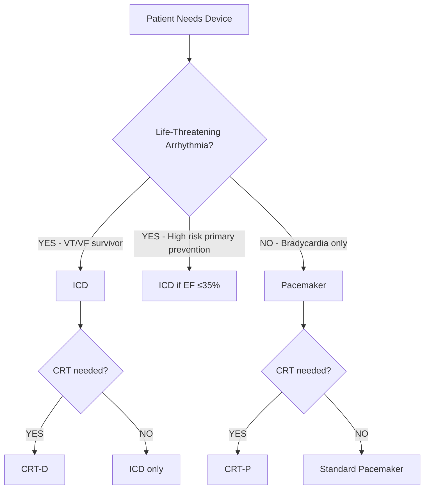

# Section 4: Clinical Assessment (3.5% of exam)

> [!info] Section Overview
> - **Exam Weight**: 3.5%
> - **Total Videos**: 10 videos
> - **Duration**: ~1.5 hours
> - **Priority**: 🟢 LOW

**Focus**: Patient evaluation, history, physical exam, and device selection

---

## 4.A. Patient History & Symptoms

> [!example] Video Breakdown: 3 videos, ~30 minutes

### Video 1: Taking a Device-Focused History (10-12 min)

**Key History Components:**

| Symptom | Device Implication |
|---------|-------------------|
| **Syncope** | High-degree AVB, VT/VF → Pacemaker or ICD |
| **Presyncope** | Symptomatic brady, pause-dependent VT |
| **Palpitations** | SVT (ablation), VT (ICD), PVCs (reassurance) |
| **Dyspnea on exertion** | Chronotropic incompetence → Rate-responsive |
| **Orthopnea/PND** | Heart failure → Consider CRT if LBBB |
| **Chest pain** | Rule out ischemia before device |

**Characterizing Syncope:**
- Sudden vs gradual onset
- Associated symptoms (palpitations, dyspnea)
- Triggers (exertion, standing, head turning)
- Frequency and injury risk
- Prodrome (warning signs)

**Medication History:**
- Antiarrhythmics affecting threshold
- Beta blockers (bradycardia)
- Diuretics (electrolytes)
- Anticoagulation status

---

### Video 2: Physical Examination for Device Patients (10-12 min)

**Cardiovascular Exam:**

> [!important] Key Findings
> - **Bradycardia** (<50 bpm): Check BP, symptoms
> - **Irregular rhythm**: A-fib → VVI mode
> - **Cannon A-waves**: AV dissociation (complete heart block)
> - **S3 gallop**: Heart failure → CRT candidate
> - **Murmurs**: Valvular disease may worsen with pacing

**Device Pocket Exam:**
- Swelling, erythema (infection)
- Hematoma (anticoagulation issue)
- Erosion (impending skin breakdown)
- Twiddler's (device rotated, leads retracted)

**Pulmonary Exam:**
- Rales (heart failure)
- Decreased breath sounds (pleural effusion post-implant)

---

### Video 3: Functional Status Assessment (8-10 min)

**NYHA Classification:**

| Class | Symptoms | CRT Indication |
|-------|----------|----------------|
| **I** | No limitation | No |
| **II** | Slight limitation, dyspnea with moderate exertion | Yes (if EF ≤35%, LBBB) |
| **III** | Marked limitation, dyspnea with minimal exertion | Yes (strong) |
| **IV** | Symptoms at rest | Yes (if ambulatory) |

**Exercise Capacity:**
- 6-minute walk distance
- Metabolic equivalents (METs)
- Need for rate-responsive pacing

---

## 4.B. Diagnostic Testing

> [!example] Video Breakdown: 4 videos, ~40 minutes

### Video 4: ECG & Holter Monitoring (10-12 min)

**When to Order:**

| Test | Indication | What It Shows |
|------|------------|---------------|
| **12-lead ECG** | All patients | Rhythm, blocks, ischemia, QRS width |
| **24-48h Holter** | Palpitations, suspected pause | Captures infrequent events, correlates symptoms |
| **Event monitor** | Rare symptoms (<1/week) | Patient-activated recording |
| **Implantable loop recorder** | Unexplained syncope | Up to 3 years of monitoring |

**Holter Interpretation:**
- Longest pause, average HR, % pacing
- Symptom-rhythm correlation
- Burden of arrhythmias

---

### Video 5: Echocardiography for Device Selection (10-12 min)

**Key Measurements:**

> [!important] CRT Screening Echo
> - **LVEF**: ≤35% (Class I indication)
> - **LV end-diastolic dimension**: >55mm (remodeling)
> - **Mitral regurgitation**: May improve with CRT
> - **Dyssynchrony**: Septal flash, apical rocking (visual cues)

**Other Findings:**
- RV function (affects CRT response)
- Valvular disease (may need correction first)
- Pericardial effusion (tamponade risk)

---

### Video 6: Stress Testing & Chronotropic Assessment (8-10 min)

**Chronotropic Incompetence (CI):**

> [!info] Definition
> Inability to achieve ≥80% of age-predicted maximum HR
> Age-predicted max = 220 − age

**Stress Test Protocol:**
- Bruce protocol (most common)
- Monitor: HR response, symptoms, ischemia
- **CI confirmed** → Program rate-responsive pacing

---

### Video 7: Advanced Imaging & EP Studies (8-10 min)

**Cardiac MRI:**
- Scar quantification (VT substrate)
- Viability assessment (CRT response prediction)
- **Caution**: Not all devices MRI-conditional

**Cardiac CT:**
- Coronary anatomy
- Lead/device position
- CS anatomy for CRT planning

**EP Study:**
- Inducible VT (ICD indication)
- HV interval >70ms (high-grade block risk)
- Accessory pathway mapping (WPW)

---

## 4.C. Device Selection

> [!example] Video Breakdown: 3 videos, ~30 minutes

### Video 8: Pacemaker vs ICD Decision (10-12 min)

**Decision Tree:**

**ICD Indications (Primary Prevention):**
- Ischemic cardiomyopathy, EF ≤35%, NYHA II-III
- Non-ischemic cardiomyopathy, EF ≤35%, NYHA II-III
- ARVC, Brugada, Long QT, HCM with risk factors

---

### Video 9: Single vs Dual Chamber Decision (8-10 min)

**Mode Selection:**

| Rhythm | Sinus Function | AV Conduction | Best Mode |
|--------|----------------|---------------|-----------|
| Sinus | Normal | Intact | AAI (rare in practice) |
| Sinus | Sick sinus | Intact | AAI or DDD with long AV |
| Sinus | Normal | AV block | DDD |
| A-fib | N/A | Any | VVI(R) |

**Minimize Ventricular Pacing:**
- Use MVP, AV Search Hysteresis
- Better outcomes, lower A-fib risk

---

### Video 10: CRT Candidate Selection (10-12 min)

**Class I Indications (All Must Be Met):**

> [!success] Strong CRT Recommendation
> 1. **LVEF ≤35%**
> 2. **Sinus rhythm**
> 3. **LBBB morphology**
> 4. **QRS ≥150ms**
> 5. **NYHA II, III, or ambulatory IV**
> 6. **Optimal medical therapy**

**Class IIa (Reasonable):**
- QRS 120-149ms with LBBB
- A-fib if rate-controlled or AVN ablation planned

**Poor CRT Candidates:**
- RBBB (unless right bundle branch block)
- Extensive scar (>50% of LV)
- Severe COPD, frailty

---

### 📝 Section 4 Quiz

1. NYHA Class III with EF 30%, LBBB 160ms → (CRT-P, CRT-D ✓, ICD only)
2. Chronotropic incompetence requires: (VVI, VVIR ✓, DDD)
3. Cannon A-waves indicate: (A-fib, complete heart block ✓, sinus rhythm)
4. Primary prevention ICD: EF threshold (≤30%, ≤35% ✓, ≤40%)
5. Best CRT responders have: (RBBB, LBBB ≥150ms ✓, narrow QRS)

---

[[README|← Back to Master Plan]] | [[Section_3_ECG|← Previous: Section 3]] | [[Section_5_Perioperative|Next: Section 5 →]]
